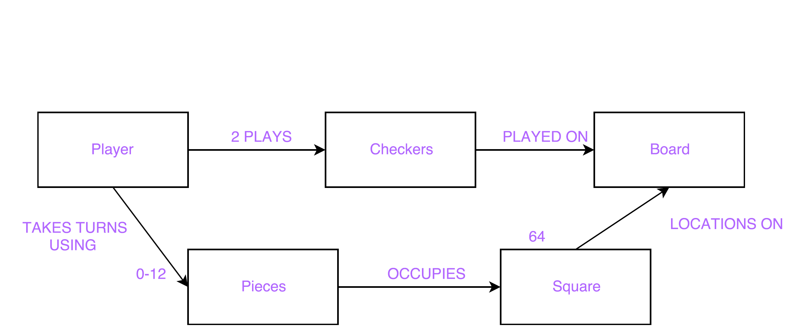
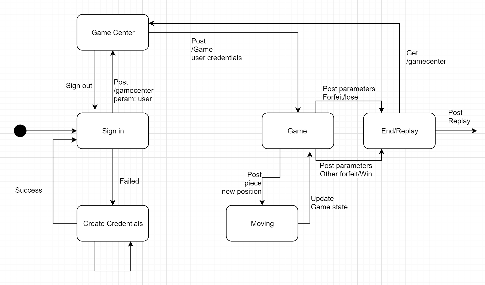

# PROJECT Design Documentation

# Team Information
* Team name: 2175-swen-261-02-d
* Team members
  * Joel Margolis
  * Brandon Dossantos
  * Jake Edom
  * Qadir Haqq
  * Sameen Luo

## Executive Summary

An application that allows signed in players to play checkers with other signed in players. Players use drag and drop capabilities in the browser to make moves.

### Purpose

Allow players to play checker games in their browsers.

### Glossary and Acronyms
> Provide a table of terms and acronyms.

| Term | Definition |
|------|------------|
| VO | Value Object |

## Requirements

This section describes the features of the application.

> In this section you do not need to be exhaustive and list every story.  Focus on top-level features from the Vision document and maybe Epics and critical Stories.

### Definition of MVP

Every player must sign-in before playing a game, and be able to sign-out when finished playing.
Two players must be able to play a game of checkers based upon the American rules.
Either player of a game may choose to resign, at any point, which ends the game.

### MVP Features
> Provide a list of top-level Epics and/or Stories of the MVP.

Start a Game
As a Player I want to start a game so that I can play checkers with an opponent.

### Roadmap of Enhancements
> Provide a list of top-level features in the order you plan to consider them.

## Application Domain

This section describes the application domain.

The most important entities in the domain of this project are *player*, *board*, *pieces* and the *checkers* game. 
Two *players* (red/white) initiates a game of *checkers*. They are given the same *board* on their browser with opposite rotations. 
On their *board* in the browser, each *player* has the ownership of 12 pieces according to his/her color. The *player* can drag and drop
one movable *piece* (according to American rule) each turn to make a move to take off his/her opponent's *pieces* as many as possible 
to win this *checkers* game. 

## Architecture

This section describes the application architecture.

### Summary

The following Tiers/Layers model shows a high-level view of the webapp's architecture.

As a web application, the user interacts with the system using a browser.  The client-side
of the UI is composed of HTML pages with some minimal CSS for styling the page.  There is also
some JavaScript that has been provided to the team by the architect.

The server-side tiers include the UI Tier that is composed of UI Controllers and Views.
Controllers are built using the Spark framework and View are built using the FreeMarker framework.  The Application and Model tiers are built using plain-old Java objects (POJOs).

Details of the components within these tiers are supplied below

### Overview of User Interface

This section describes the web interface flow; this is how the user views and interacts
with the WebCheckers application.

Upon opening the home page in a browser, a user is shown the signin link. Once clicked on the signin link, the user is brought to the 
signin page. There, the user enters their username and clicks signin to submit. Once submit, the user is shown a list of
signed in opponents to choose from is there are any. If not, the wait message shows until another player signs in. 
After the user clicks on an opponent to start a game, they are brought to the game page where the board with their 
red/white pieces are shown. On the board, they can drag and drop their own pieces to make moves. 

### UI Tier
> Provide a summary of the Server-side UI tier of your architecture.
> Describe the types of components in the tier and describe their responsibilities.

#### Static models
> Provide one or more static models (UML class or object diagrams) with some details such as critical attributes and methods.

#### Dynamic models
> Provide any dynamic models, such as state and sequence diagrams, as is relevant to a particularly significant user story.
> For example, in WebCheckers you might create a sequence diagram of the `POST /validateMove` HTTP request processing or you might use a state diagram if the Game component uses a state machine to manage the game.

### Application Tier
> Provide a summary of the Application tier of your architecture.
> Describe the types of components in the tier and describe their responsibilities.

#### Static models
> Provide one or more static models (UML class or object diagrams) with some details such as critical attributes and methods.

#### Dynamic models
> Provide any dynamic model, such as state and sequence diagrams, as is relevant to a particularly significant user story.

### Model Tier
> Provide a summary of the Model tier of your architecture.
> Describe the types of components in the tier and describe their responsibilities.

#### Static models
> Provide one or more static models (UML class or object diagrams) with some details such as critical attributes and methods.

#### Dynamic models
> Provide any dynamic model, such as state and sequence diagrams, as is relevant to a particularly significant user story.
