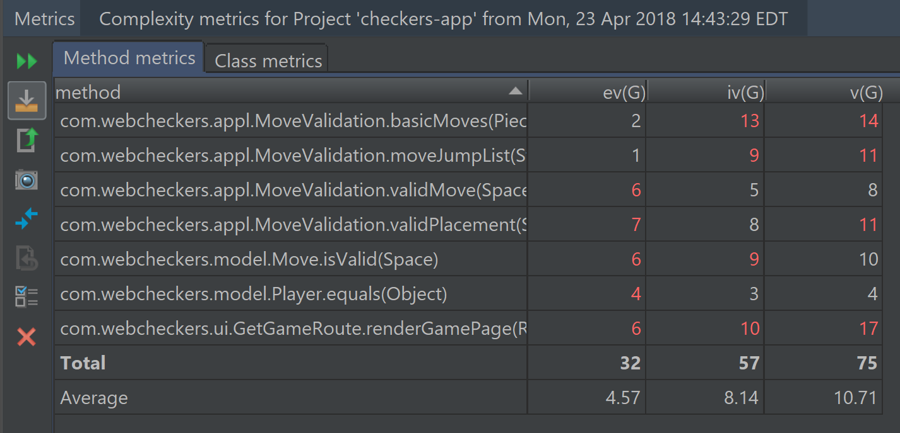

# PROJECT Design Documentation

# Team Information
* Team name: 2175-swen-261-02-d
* Team members
  * Joel Margolis
  * Brandon Dossantos
  * Jake Edom
  * Qadir Haqq
  * Sameen Luo

## Executive Summary

An application that allows signed in players to play checkers with other signed in players. Players use drag and drop capabilities in the browser to make moves.

### Purpose

Allow players to play checker games in their browsers.

### Glossary and Acronyms
> Provide a table of terms and acronyms.

| Term | Definition |
|------|------------|
| VO | Value Object |

## Requirements

This section describes the features of the application.

### Definition of MVP

Every player must sign-in before playing a game, and be able to sign-out when finished playing.
Two players must be able to play a game of checkers based upon the American rules.
Either player of a game may choose to resign, at any point, which ends the game.

### MVP Features

Start a Game
As a Player I want to start a game so that I can play checkers with an opponent.

Validate Moves
As a player I want to be able to drag and drop valid checker pieces so that I can make a move during a game.

Game Forfeit
As a player, I want to resign my game at any point so that I can forfeit.

### Roadmap of Enhancements

* Extend the Game View to support the ability for player to request help for the next move.

* Games can be stored and viewed later as how it was played before.

## Application Domain

This section describes the application domain.

The most important entities in the domain of this project are *player*, *board*, *pieces* and the *checkers* game. 
Two *players* (red/white) initiates a game of *checkers*. They are given the same *board* on their browser with opposite rotations. 
On their *board* in the browser, each *player* has the ownership of 12 pieces according to his/her color. The *player* can drag and drop
one movable *piece* (according to American rule) each turn to make a move to take off his/her opponent's *pieces* as many as possible 
to win this *checkers* game. 

## Architecture

This section describes the application architecture.

### Summary

The following Tiers/Layers model shows a high-level view of the webapp's architecture.

As a web application, the user interacts with the system using a browser.  The client-side
of the UI is composed of HTML pages with some minimal CSS for styling the page.  There is also
some JavaScript that has been provided to the team by the architect.

The server-side tiers include the UI Tier that is composed of UI Controllers and Views.
Controllers are built using the Spark framework and View are built using the FreeMarker framework.  The Application and Model tiers are built using plain-old Java objects (POJOs).

Details of the components within these tiers are supplied below

### Overview of User Interface

This section describes the web interface flow; this is how the user views and interacts
with the WebCheckers application.

Upon opening the home page in a browser, a user is shown the signin link. Once clicked on the signin link, the user is brought to the 
signin page. There, the user enters their username and clicks signin to submit. Once submit, the user is shown a list of
signed in opponents to choose from is there are any. If not, the wait message shows until another player signs in. 
After the user clicks on an opponent to start a game, they are brought to the game page where the board with their 
red/white pieces are shown. On the board, they can drag and drop their own pieces to make moves. 

### UI Tier
The **GetHomeRoute** renders home page that lists all main functions of the project (sign-in/sign-out button,
list of opponents to choose from). Once a user signs in, the opponent is picked and **GetGameRoute** renders
the game page with oriented checkers board with pieces for the user to drag and drop. Once game is finished
or resigned, the winner and loser are both redirected to result page through **PostResignRoute** and **GetResultRoute**
to be notified win/lose status.

#### Static models

#### Dynamic models

### Application Tier
The application tier of the project handles all the move, validation, and player storage. The application diagram above
shows how the different components of the application tier communicate between each other. 

#### Static models

#### Dynamic models

Add dynamic models here and then they describe the dynamic  behavior over time of different objrcts and how they wor togehrer.
### Model Tier
The model tier works to emulate the various pieces that make up a game of checkers including a Game object which
emulates the game overall holding the board and players and determining a winner once one of the win conditions has
been achieved. Moving to the Board object which works as the board of the game responsible for holding spaces and moving
pieces around when needed. A Space is the object which fills up the board object and holds pieces in place their places
as well. Next is the piece object which acts as the pieces on a checkers board which which have their own color and
location, additionally know if they are a king piece or not. Next is the Player object which holds the total amount
of pieces left, as well as keep track if they are in a game for the server's sake. Finally are the Move and Message
objects, which act as helper functions with Move it helps place moves into a readable notation and Message works to send
string info to wherever it is needed.

#### Static models

#### Dynamic models

## Test Coverage

## Future Refactoring and Improvements
### Design Principles

### Code Metrics 

No warnings found in other metrics.